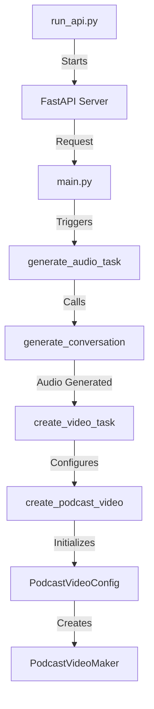
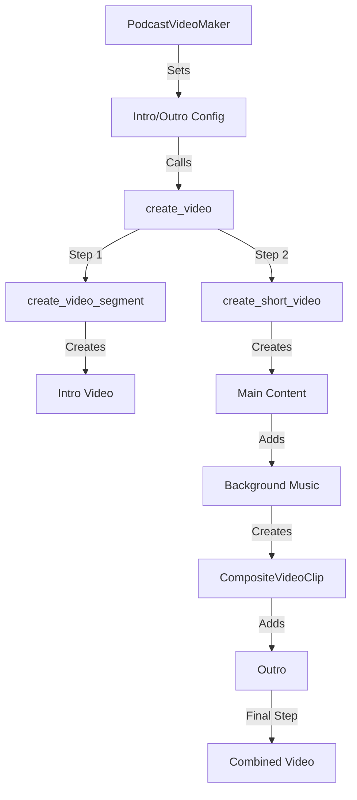

# PodCraft AI - Comprehensive System Documentation

## 1. System Overview
PodCraft AI is an advanced podcast video creation system that automates the generation of engaging podcast-style videos. The system employs a microservices architecture with FastAPI for the web interface and Celery for handling resource-intensive background tasks.

## 2. System Architecture

### 2.1 Core Components
1. **API Layer** (`run_api.py` & `api/main.py`)
   - FastAPI server running on port 8000
   - CORS-enabled for cross-origin requests
   - Static file serving for generated outputs
   - RESTful endpoints for podcast generation and status checking

2. **Task Queue System** (`celery_app/tasks.py`)
   - Uses Redis as message broker and result backend
   - Two main Celery tasks:
     - `generate_audio_task`: Handles conversation and audio generation
     - `create_video_task`: Manages video creation and composition

3. **Podcast Creation Engine** (`create_podcast_with_video.py`)
   - Core orchestration module
   - Manages configuration and workflow
   - Handles task coordination between audio and video generation

4. **Profile Management** (`profiles/`)
   - JSON-based profile configurations
   - Stores business information and podcast settings
   - Customizable parameters for different podcast styles

### 2.2 Database Structure
- Uses SQLAlchemy ORM
- Tracks podcast jobs and their statuses
- Main model: `PodcastJob` for job tracking

## 3. Key Features

### 3.1 Audio Generation
- Configurable conversation parameters:
  - Number of turns
  - Conversation mood
  - Language selection
  - Voice accent preferences
  - Custom voice IDs for speakers
  - Speaker name customization

### 3.2 Video Creation
- High-quality video generation with customizable:
  - Resolution (default: 1920x1080)
  - Background music and volume
  - Video library integration
  - Background images
  - Font settings for titles and subtitles
  - Footer customization

### 3.3 Configuration Options (`PodcastCreationConfig`)
- Title and subtitle customization
- Font settings (size, color, family)
- Visual elements:
  - Background images
  - Music tracks
  - Video library
- Text styling for titles, subtitles, and footer

## 4. API Endpoints

### 4.1 Main Endpoints
1. **Create Podcast** 
   - Endpoint: POST `/create_podcast`
   - Payload: `PodcastRequest` (profile_name, conversation_type, topic)
   - Returns: Job ID for tracking

2. **Get Status**
   - Endpoint: GET `/podcast_status/{job_id}`
   - Returns: Current status of podcast generation

3. **List Podcasts**
   - Endpoint: GET `/podcasts`
   - Returns: List of all podcast jobs

## 5. Directory Structure
```
podcraftai/
├── api/                 # FastAPI application
├── celery_app/         # Celery tasks and config
├── create_audio/       # Audio generation module
├── video_creator/      # Video creation module
├── profiles/           # Profile configurations
├── utils/              # Utility functions
├── outputs/            # Generated content
└── static/             # Static assets
```

## 6. Configuration and Deployment

### 6.1 Environment Variables
Required environment variables in `.env`:
- `CELERY_BROKER_URL`: Redis URL for Celery broker
- `CELERY_RESULT_BACKEND`: Redis URL for Celery results

### 6.2 Dependencies
Key dependencies from `requirements.txt`:
- FastAPI: Web framework
- Celery: Task queue
- Redis: Message broker
- SQLAlchemy: Database ORM
- Various audio/video processing libraries

### 6.3 Setup and Installation
1. Clone the repository
2. Create and activate virtual environment:
   ```bash
   python -m venv venv
   source venv/bin/activate  # On Unix/macOS
   ```
3. Install dependencies:
   ```bash
   pip install -r requirements.txt
   ```
4. Set up Redis server
5. Configure environment variables
6. Initialize database:
   ```bash
   python reset_db.py
   ```

### 6.4 Running the System
1. Start Redis server
2. Start Celery worker:
   ```bash
   celery -A celery_app.tasks worker --loglevel=info
   ```
3. Start FastAPI server:
   ```bash
   python run_api.py
   ```

## 7. Workflow

1. **Request Initiation**
   - Client sends podcast creation request
   - System loads profile configuration
   - Creates database entry for job tracking

2. **Audio Generation**
   - Generates conversation based on topic
   - Creates audio files for each speaker
   - Processes welcome message if configured

3. **Video Creation**
   - Combines audio with visual elements
   - Applies background music and images
   - Renders final video with titles and effects

4. **Output Delivery**
   - Saves final video to outputs directory
   - Makes content available via static file serving
   - Updates job status for client tracking

## 8. Detailed System Flow

### 8.1 Request Flow


### 8.2 Video Creation Flow


### 8.3 Detailed Process Description

1. **Server Initialization**
   - `run_api.py` starts the FastAPI server
   - Server listens for incoming requests

2. **Request Processing**
   - Requests are handled by `main.py`
   - Main API endpoints process incoming requests
   - Triggers asynchronous Celery tasks

3. **Audio Generation Phase**
   - `generate_audio_task` (Celery task) is initiated
   - Calls `generate_conversation` to create podcast audio
   - Handles voice generation and conversation flow
   - Audio files are saved for video creation

4. **Video Creation Initialization**
   - `create_video_task` (Celery task) begins after audio completion
   - Sets parameters from configuration
   - Initializes video creation process

5. **Video Configuration**
   - Creates `PodcastVideoConfig` instance
   - Sets up all necessary video parameters
   - Initializes `PodcastVideoMaker` with configuration

6. **Video Generation Process**
   - `PodcastVideoMaker` sets intro and outro configurations
   - Calls main video creation function
   - Process follows specific order:
     a. Creates intro video segment
     b. Generates main content short video
     c. Adds background music and effects
     d. Creates composite video with all elements
     e. Adds outro segment
     f. Combines all segments into final video

7. **Video Composition Steps**
   - `create_video_segment`: Handles intro video creation
   - `create_short_video`: Processes main content
   - Background music integration
   - `CompositeVideoClip`: Combines all elements
   - Final video assembly with outro

8. **Output Generation**
   - Final video is rendered with all components
   - Output is saved to specified location
   - Status is updated in the system

### 8.4 Key Components Interaction

- **Configuration Flow**: Profile settings → Video Config → Maker Instance
- **Content Generation**: Audio → Video Segments → Complete Video
- **Process Management**: API → Celery Tasks → Video Processing
- **Resource Handling**: File Management → Video Processing → Output Generation

## 9. Profile Configuration

### 9.1 Profile Structure
Profiles are JSON files in the `profiles/` directory containing:
- Business information
- Voice settings
- Visual preferences
- Conversation parameters

Example profile structure:
```json
{
    "business_info": {
        "name": "Example Business",
        "tagline": "Your Business Tagline"
    },
    "podcast_config": {
        "num_turns": 5,
        "conversation_mood": "explaining in simple terms",
        "language": "English",
        "voice_accent": "Indian"
    },
    "visual_config": {
        "title": "AI Tech Talk",
        "subtitle": "Impact and Future Prospects",
        "resolution": [1920, 1080],
        "bg_music_volume": 0.1
    }
}
```

## 10. Error Handling and Logging

### 10.1 Logging System
- Uses custom `PodcastLogger` class
- Separate logs for API, tasks, and core functions
- Log levels: INFO, WARNING, ERROR
- Logs stored in `logs/` directory

### 10.2 Error Handling
- API endpoints with proper error responses
- Task retry mechanisms for transient failures
- Database transaction management
- File system error handling

## 11. Best Practices and Maintenance

### 11.1 Code Organization
- Modular architecture
- Clear separation of concerns
- Configuration through environment variables
- Proper logging and error handling

### 11.2 Backup and Recovery
- Regular database backups
- Output file management
- Profile backup procedures
- Error recovery mechanisms

### 11.3 Performance Optimization
- Async task processing
- Resource management
- Caching strategies
- Output file cleanup

## 12. Security Considerations

### 12.1 API Security
- CORS configuration
- Input validation
- Rate limiting
- Authentication (if implemented)

### 12.2 File System Security
- Proper file permissions
- Secure file handling
- Output directory protection
- Temporary file cleanup

### 12.3 Environment Security
- Secure environment variables
- API key management
- Redis security
- Database security

## 13. Troubleshooting Guide

### 13.1 Common Issues
1. **Redis Connection Issues**
   - Check Redis server status
   - Verify connection URLs
   - Check network connectivity

2. **Task Processing Issues**
   - Verify Celery worker status
   - Check task queue
   - Monitor resource usage

3. **File Generation Issues**
   - Check disk space
   - Verify file permissions
   - Monitor output directory

### 13.2 Debugging Tools
- Celery task monitoring
- API endpoint testing
- Log analysis
- Database queries

## 14. Future Enhancements

### 14.1 Potential Improvements
1. Additional video templates
2. More voice options
3. Enhanced error recovery
4. Performance optimizations
5. Additional output formats

### 14.2 Planned Features
1. User authentication
2. Advanced profile management
3. Real-time progress updates
4. Enhanced monitoring tools

---

This documentation is maintained by the PodCraft AI development team. For updates or contributions, please follow the standard pull request process.
